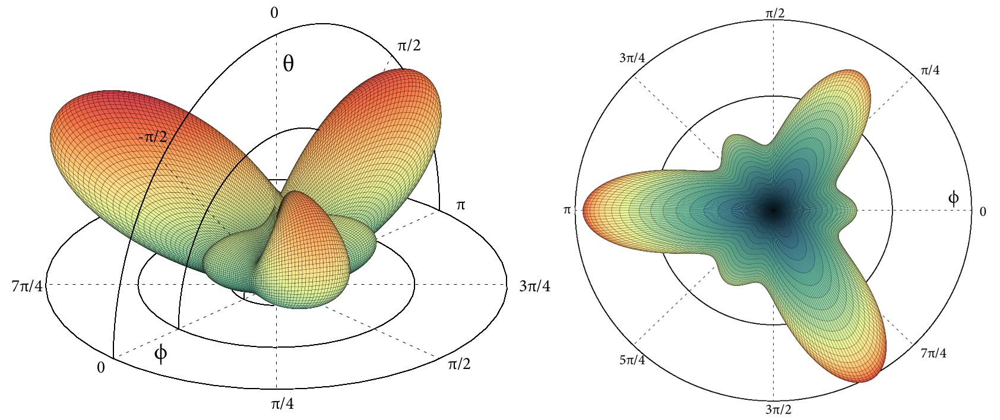

Theoretical Optical Second-Harmonic Calculations for Surfaces
================================================================

 Theoretical Optical Second-Harmonic Calculations for Surfaces by <a xmlns:cc="http://creativecommons.org/ns#" href="https://github.com/roguephysicist/thesis-phd" property="cc:attributionName" rel="cc:attributionURL">Sean M. Anderson</a> is licensed under a <a rel="license" href="http://creativecommons.org/licenses/by-sa/4.0/">Creative Commons Attribution-ShareAlike 4.0 International License</a>.

Copyright (C) 2016 Sean M Anderson

DOI:[10.13140/RG.2.2.35619.66082](http://dx.doi.org/10.13140/RG.2.2.35619.66082)

In this thesis we formulate a theoretical approach of surface second-harmonic
generation (SSHG) from semiconductor surfaces based on the length gauge and the
electron density operator. Within the independent particle approximation, the
surface nonlinear second-order surface susceptibility tensor is calculated. We
include, in one unique formulation: (ii) the scissors correction, needed to have
the correct value of the energy band gap, (ii) the contribution of the nonlocal
part of the pseudopotentials, and (iii) the derivation for the inclusion of the
cut function, used to extract the surface response. The first two contributions
are described by spatially nonlocal quantum mechanical operators and are fully
taken into account in the present formulation.

We also revisit the three layer model for the SSHG yield and demonstrate that it
provides more accurate results over several, more common, two layer models. We
fully derive the expressions for the SSHG yield, including the effect of
multiple reflections from both the second-harmonic and fundamental waves into
the final expressions. These detailed derivations are applicable to any surface,
regardless of symmetry considerations.

This entire framework is implemented in the TINIBA software suite, which was
developed over the course of this doctoral project. We will apply this framework
for the clean Si(001)(2x1) and Si(111)(1x1):H surfaces, and compare with various
experimental spectra from several different sources. These surfaces provide an
excellent platform for comparison with theory, and allows us to offer this study
as an efficient benchmark for this type of calculation. Finally, we can conclude
that this new approach to the calculation of the second-harmonic spectra is
versatile and accurate within this level of approximation.

Please use this research and source code to help further your own scientific and
academic endeavors. However, these source files are free and open source
software. They comes with no warranty of any kind.
